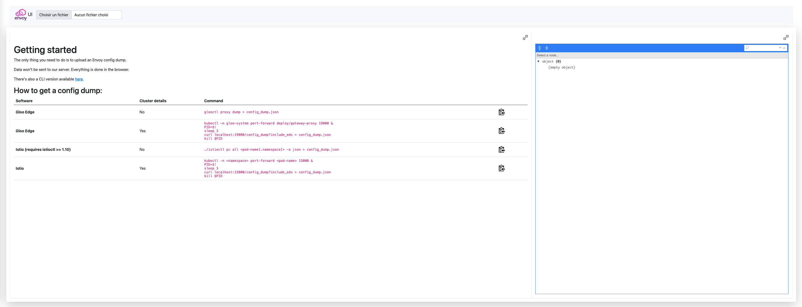

# envoyctl

A CLI tool to help debugging Envoy

## Dependencies

You simply need to have [Node.js](https://nodejs.org) installed

## Installation

```
git clone https://github.com/djannot/envoyctl.git
cd envoyctl
npm install
```

You can then run `node envoyctl.js`.

But you can also run `npm link` to make it available through `envoyctl`.

## Usage

You can run `envoyctl -h` to display the help.

But the basic usage is either:

```
envoyctl -f <Envoy config dump file>
```

or

```
cat <Envoy config dump file> | envoyctl -f -
```

It has been tested with both Gloo Edge and Istio.

For example, to see the configuratin of the Istio ingress gateway:

```
kubectl -n istio-system port-forward deploy/istio-ingressgateway 15000 &
PID=$!
sleep 3
curl localhost:15000/config_dump | envoyctl -f -
kill $PID
```

or with `istioctl` (>= 1.10):

```
istioctl pc all deploy/istio-ingressgateway.istio-system -o json | envoyctl -f -
```

Here is an example of the output you can get:

```
┌────────────────────┬──────────────────────────────┬──────────────────────────────────────────────────┬──────────────────────────────────────────────────┬──────────────────────────────────────────────────┬──────────────────────────────────────────────────┬──────────────────────────────────────────────────┬──────────────────────────────────────────────────┐
│ Dynamic listener   │ Route name                   │ Domains                                          │ Match                                            │ Route                                            │ Per filter config                                │ Cluster                                          │ Endpoints                                        │
├────────────────────┼──────────────────────────────┼──────────────────────────────────────────────────┼──────────────────────────────────────────────────┼──────────────────────────────────────────────────┼──────────────────────────────────────────────────┼──────────────────────────────────────────────────┼──────────────────────────────────────────────────┤
│ 0.0.0.0_8383       │ 8383                         │ *                                                │ {                                                │ {                                                │                                                  │ {                                                │                                                  │
│                    │                              │                                                  │   "prefix": "/"                                  │   "cluster": "PassthroughCluster",               │                                                  │   "@type": "type.googleapis.com/envoy.config.cl… │                                                  │
│                    │                              │                                                  │ }                                                │   "timeout": "0s",                               │                                                  │   "name": "PassthroughCluster",                  │                                                  │
│                    │                              │                                                  │                                                  │   "max_grpc_timeout": "0s"                       │                                                  │   "type": "ORIGINAL_DST",                        │                                                  │
│                    │                              │                                                  │                                                  │ }                                                │                                                  │   "connect_timeout": "10s",                      │                                                  │
│                    │                              │                                                  │                                                  │                                                  │                                                  │   "lb_policy": "CLUSTER_PROVIDED",               │                                                  │
│                    │                              │                                                  │                                                  │                                                  │                                                  │   "circuit_breakers": {                          │                                                  │
│                    │                              │                                                  │                                                  │                                                  │                                                  │     "thresholds": [                              │                                                  │
│                    │                              │                                                  │                                                  │                                                  │                                                  │       {                                          │                                                  │
│                    │                              │                                                  │                                                  │                                                  │                                                  │         "max_connections": 4294967295,           │                                                  │
│                    │                              │                                                  │                                                  │                                                  │                                                  │         "max_pending_requests": 4294967295,      │                                                  │
│                    │                              │                                                  │                                                  │                                                  │                                                  │         "max_requests": 4294967295,              │                                                  │
│                    │                              │                                                  │                                                  │                                                  │                                                  │         "max_retries": 4294967295,               │                                                  │
│                    │                              │                                                  │                                                  │                                                  │                                                  │         "track_remaining": true                  │                                                  │
│                    │                              │                                                  │                                                  │                                                  │                                                  │       }                                          │                                                  │
│                    │                              │                                                  │                                                  │                                                  │                                                  │     ]                                            │                                                  │
│                    │                              │                                                  │                                                  │                                                  │                                                  │   },                                             │                                                  │
│                    │                              │                                                  │                                                  │                                                  │                                                  │   "typed_extension_protocol_options": {          │                                                  │
│                    │                              │                                                  │                                                  │                                                  │                                                  │     "envoy.extensions.upstreams.http.v3.HttpPro… │                                                  │
│                    │                              │                                                  │                                                  │                                                  │                                                  │       "@type": "type.googleapis.com/envoy.exten… │                                                  │
│                    │                              │                                                  │                                                  │                                                  │                                                  │       "use_downstream_protocol_config": {        │                                                  │
│                    │                              │                                                  │                                                  │                                                  │                                                  │         "http_protocol_options": {},             │                                                  │
│                    │                              │                                                  │                                                  │                                                  │                                                  │         "http2_protocol_options": {              │                                                  │
│                    │                              │                                                  │                                                  │                                                  │                                                  │           "max_concurrent_streams": 1073741824   │                                                  │
│                    │                              │                                                  │                                                  │                                                  │                                                  │         }                                        │                                                  │
│                    │                              │                                                  │                                                  │                                                  │                                                  │       }                                          │                                                  │
│                    │                              │                                                  │                                                  │                                                  │                                                  │     }                                            │                                                  │
│                    │                              │                                                  │                                                  │                                                  │                                                  │   },                                             │                                                  │
│                    │                              │                                                  │                                                  │                                                  │                                                  │   "filters": [                                   │                                                  │
│                    │                              │                                                  │                                                  │                                                  │                                                  │     {                                            │                                                  │
│                    │                              │                                                  │                                                  │                                                  │                                                  │       "name": "istio.metadata_exchange",         │                                                  │
│                    │                              │                                                  │                                                  │                                                  │                                                  │       "typed_config": {                          │                                                  │
│                    │                              │                                                  │                                                  │                                                  │                                                  │         "@type": "type.googleapis.com/udpa.type… │                                                  │
│                    │                              │                                                  │                                                  │                                                  │                                                  │         "type_url": "type.googleapis.com/envoy.… │                                                  │
│                    │                              │                                                  │                                                  │                                                  │                                                  │         "value": {                               │                                                  │
│                    │                              │                                                  │                                                  │                                                  │                                                  │           "protocol": "istio-peer-exchange"      │                                                  │
│                    │                              │                                                  │                                                  │                                                  │                                                  │         }                                        │                                                  │
│                    │                              │                                                  │                                                  │                                                  │                                                  │       }                                          │                                                  │
│                    │                              │                                                  │                                                  │                                                  │                                                  │     }                                            │                                                  │
│                    │                              │                                                  │                                                  │                                                  │                                                  │   ]                                              │                                                  │
│                    │                              │                                                  │                                                  │                                                  │                                                  │ }                                                │                                                  │
├────────────────────┼──────────────────────────────┼──────────────────────────────────────────────────┼──────────────────────────────────────────────────┼──────────────────────────────────────────────────┼──────────────────────────────────────────────────┼──────────────────────────────────────────────────┼──────────────────────────────────────────────────┤
...
│ virtualInbound     │ inbound|9080||               │ *                                                │ {                                                │ {                                                │                                                  │ {                                                │                                                  │
│                    │                              │                                                  │   "prefix": "/"                                  │   "cluster": "inbound|9080||",                   │                                                  │   "@type": "type.googleapis.com/envoy.config.cl… │                                                  │
│                    │                              │                                                  │ }                                                │   "timeout": "0s",                               │                                                  │   "name": "inbound|9080||",                      │                                                  │
│                    │                              │                                                  │                                                  │   "max_stream_duration": {                       │                                                  │   "type": "ORIGINAL_DST",                        │                                                  │
│                    │                              │                                                  │                                                  │     "max_stream_duration": "0s",                 │                                                  │   "connect_timeout": "10s",                      │                                                  │
│                    │                              │                                                  │                                                  │     "grpc_timeout_header_max": "0s"              │                                                  │   "lb_policy": "CLUSTER_PROVIDED",               │                                                  │
│                    │                              │                                                  │                                                  │   }                                              │                                                  │   "circuit_breakers": {                          │                                                  │
│                    │                              │                                                  │                                                  │ }                                                │                                                  │     "thresholds": [                              │                                                  │
│                    │                              │                                                  │                                                  │                                                  │                                                  │       {                                          │                                                  │
│                    │                              │                                                  │                                                  │                                                  │                                                  │         "max_connections": 4294967295,           │                                                  │
│                    │                              │                                                  │                                                  │                                                  │                                                  │         "max_pending_requests": 4294967295,      │                                                  │
│                    │                              │                                                  │                                                  │                                                  │                                                  │         "max_requests": 4294967295,              │                                                  │
│                    │                              │                                                  │                                                  │                                                  │                                                  │         "max_retries": 4294967295,               │                                                  │
│                    │                              │                                                  │                                                  │                                                  │                                                  │         "track_remaining": true                  │                                                  │
│                    │                              │                                                  │                                                  │                                                  │                                                  │       }                                          │                                                  │
│                    │                              │                                                  │                                                  │                                                  │                                                  │     ]                                            │                                                  │
│                    │                              │                                                  │                                                  │                                                  │                                                  │   },                                             │                                                  │
│                    │                              │                                                  │                                                  │                                                  │                                                  │   "cleanup_interval": "60s",                     │                                                  │
│                    │                              │                                                  │                                                  │                                                  │                                                  │   "upstream_bind_config": {                      │                                                  │
│                    │                              │                                                  │                                                  │                                                  │                                                  │     "source_address": {                          │                                                  │
│                    │                              │                                                  │                                                  │                                                  │                                                  │       "address": "127.0.0.6",                    │                                                  │
│                    │                              │                                                  │                                                  │                                                  │                                                  │       "port_value": 0                            │                                                  │
│                    │                              │                                                  │                                                  │                                                  │                                                  │     }                                            │                                                  │
│                    │                              │                                                  │                                                  │                                                  │                                                  │   },                                             │                                                  │
│                    │                              │                                                  │                                                  │                                                  │                                                  │   "metadata": {                                  │                                                  │
│                    │                              │                                                  │                                                  │                                                  │                                                  │     "filter_metadata": {                         │                                                  │
│                    │                              │                                                  │                                                  │                                                  │                                                  │       "istio": {                                 │                                                  │
│                    │                              │                                                  │                                                  │                                                  │                                                  │         "config": "/apis/networking.istio.io/v1… │                                                  │
│                    │                              │                                                  │                                                  │                                                  │                                                  │         "services": [                            │                                                  │
│                    │                              │                                                  │                                                  │                                                  │                                                  │           {                                      │                                                  │
│                    │                              │                                                  │                                                  │                                                  │                                                  │             "host": "productpage.default.svc.cl… │                                                  │
│                    │                              │                                                  │                                                  │                                                  │                                                  │             "name": "productpage",               │                                                  │
│                    │                              │                                                  │                                                  │                                                  │                                                  │             "namespace": "default"               │                                                  │
│                    │                              │                                                  │                                                  │                                                  │                                                  │           }                                      │                                                  │
│                    │                              │                                                  │                                                  │                                                  │                                                  │         ]                                        │                                                  │
│                    │                              │                                                  │                                                  │                                                  │                                                  │       }                                          │                                                  │
│                    │                              │                                                  │                                                  │                                                  │                                                  │     }                                            │                                                  │
│                    │                              │                                                  │                                                  │                                                  │                                                  │   }                                              │                                                  │
│                    │                              │                                                  │                                                  │                                                  │                                                  │ }                                                │                                                  │
└────────────────────┴──────────────────────────────┴──────────────────────────────────────────────────┴──────────────────────────────────────────────────┴──────────────────────────────────────────────────┴──────────────────────────────────────────────────┴──────────────────────────────────────────────────┴──────────────────────────────────────────────────┘

```

Using `glooctl`:

```
glooctl proxy dump | envoyctl -f -
```

You can also get endpoints info displayed if you include eds in the dump:

```
kubectl -n istio-system port-forward deploy/istio-ingressgateway 15000 &
PID=$!
sleep 3
curl localhost:15000/config_dump?include_eds | envoyctl -f -
kill $PID
```

## Online version

There's also a web version available at [https://envoyui.solo.io](https://envoyui.solo.io)

